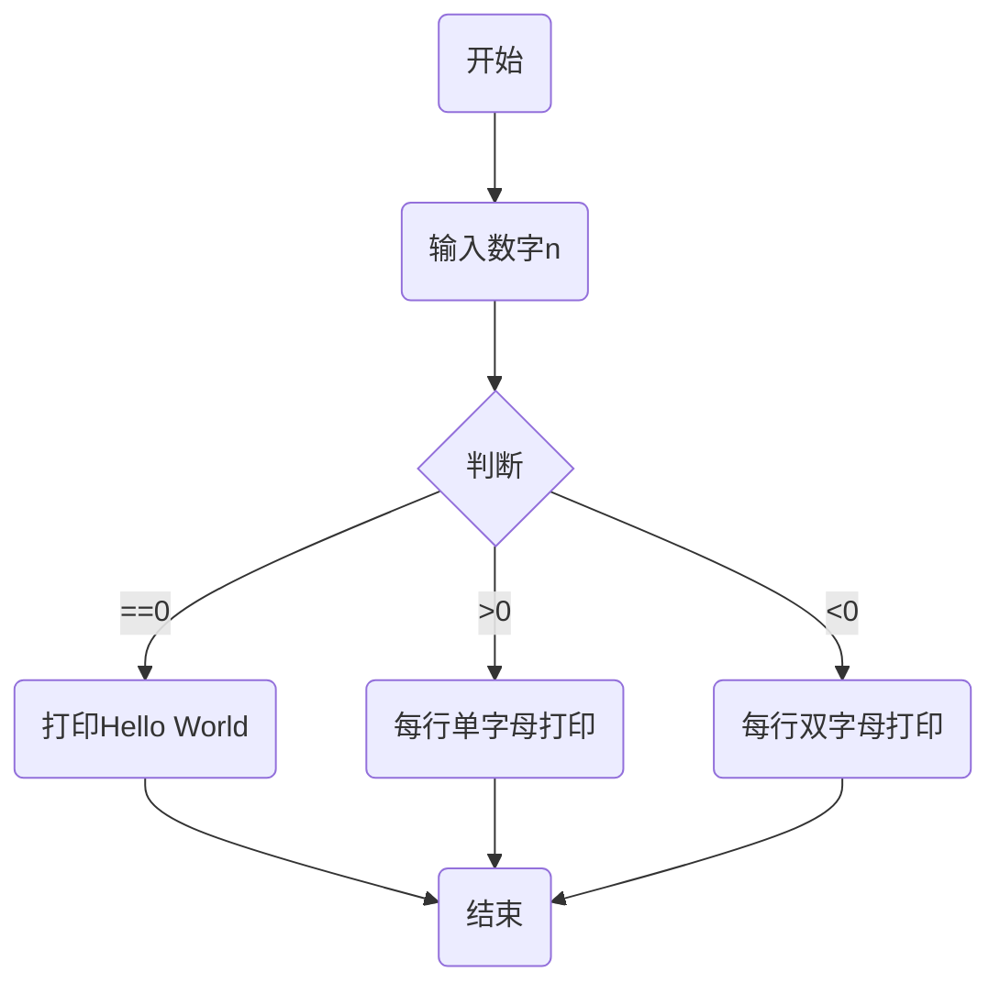

# 程序的控制结构

## Program Flowchart

例题strexp：

## 顺序结构

基本结构，顺序执行各语句

## 分支结构

代码一条一条语句顺序执行，这种代码结构通常称之为顺序结构。
然而仅有顺序结构并不能解决所有的问题，根据条件产生多个分支的情况，我们称之为“分支结构”或“选择结构”。

### if语句的使用

在Python中，要构造分支结构可以使用`if`、`elif`和`else`关键字。所谓**关键字**就是有特殊含义的单词，像`if`和`else`就是专门用于构造分支结构的关键字，很显然你不能够使用它作为变量名（事实上，用作其他的标识符也是不可以）。下面的例子中演示了如何构造一个分支结构。

唯一需要说明的是和C/C++、Java等语言不同，Python中没有用花括号来构造代码块而是使用了缩进的方式来设置代码的层次结构，如果`if`条件成立的情况下需要执行多条语句，只要保持多条语句具有相同的缩进就可以了，换句话说连续的代码如果又保持了相同的缩进那么它们属于同一个代码块，相当于是一个执行的整体。

当然如果要构造出更多的分支，可以使用`if…elif…else…`结构

### 练习

#### 练习1：英制单位英寸与公制单位厘米互换

> **说明**：inch（英寸）英尺源自于拉丁语uncia，是「1/12 部分」的意思，有些欧洲国家的语言，inch 原意是拇指，14 世纪时，英国国王爱德华二世（Edward II, 1284-1327）规定「将3 颗大麦的麦粒首尾相接，排成一直线的长度」，订为「英寸」，1 英寸大约是成人「大拇指尖端到第一指关节」的长度。1930 年，英国标准协会（British StandardsInstitution）订定「1 英寸等于2.54厘米」的换算标准。

#### 练习2：百分制成绩转换为等级制成绩

> **要求**：如果输入的成绩在90分以上（含90分）输出A；80分-90分（不含90分）输出B；70分-80分（不含80分）输出C；60分-70分（不含70分）输出D；60分以下输出E。

#### 练习3：输入三条边长，如果能构成三角形就计算周长和面积

>**说明：**
>[海伦公式]已知三角形的边为a,b,c，
>$p = (a+b+c)/2$，则
>$$S = \sqrt{p(p-a)(p-b)(p-c)}$$

## 循环结构

~~~ python
while ...:
    ......

for i in range(10):
    ......
~~~

## 异常处理

~~~ python
try
    .....
except:
    .....
else:
    .....
finally:
    .....
~~~