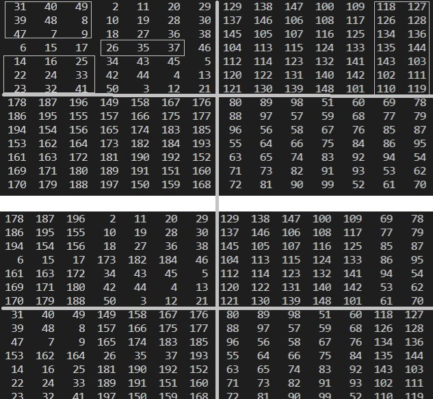

# 多阶幻方填充的程序设计

需要分为奇阶和偶阶两大种情况处理，其中偶阶需要再分为双偶、单偶两种情况处理。

## 奇阶幻方

填写规律较为简单，具体步骤如下：

1. 设定幻方为n行n列，行列坐标从0~n-1，行列坐标增加/减少时进行模n的运算
2. 选取首行中心位置为当前位置(x,y)，设置当前值1
3. 把当前位置右上方位置为新位置
4. 如果新位置为空，直接填充，重复步骤3
5. 如果新位置有值，则把新位置变为原当前位置下方并填充值，重复步骤3


```flow
start=>start: 开始
end=>end: 结束

op_init=>operation: 设定奇阶幻方为 n X n
坐标从0~n-1

loop_init=>operation: 循环初始化
当前位置为首行中间位置
fill_current=>operation: 填充当前位置
con_end=>condition: 是否填充完成?
turndown=>operation: 将新位置变为当前位置下方
con_fillnext=>condition: 右上方位置为空?

start->op_init->loop_init->fill_current->con_end
con_end(yes)->end
con_end(no)->con_fillnext
con_fillnext(yes)->fill_current
con_fillnext(no)->turndown->fill_current

```

## 偶阶幻方

当n为偶数时，我们称幻方为偶阶幻方。需要分为双偶和单偶两种情况处理。

### 双偶幻方

当n可以被4整除时，我们称该偶阶幻方为双偶幻方，如4阶、8阶、12阶、16阶等
双偶幻方用Spring法、Strachey法生成。

#### Spring法生成双偶幻方

方法就是两句话：顺序填数，以中心点对称互换数字。
将n阶双偶幻方表示为4m阶幻方。将n阶幻方看作一个矩阵，记为A，其中的第i行j列方格内的数字记为a(i,j)。

* 第一步，顺序填数

先令a(i,j)=(i-1)*n+j，即第一行从左到可分别填写1、2、3、……、n；即第二行从左到可分别填写n+1、n+2、n+3、……、2n；…………n^2【n的平方】。
简单地说，就是1放在幻方的任意一个角格，然后按同一个方向按顺序依次填写其余数。

* 第二步，对称交换
    对称交换的方法有两种：
  * 对称交换方法一
将左上区域i+j为偶数的与幻方内以中心点为对称点的右下角对角数字进行交换；
将右上区域i+j为奇数的与幻方内以中心点为对称点的左下角对角数字进行交换。
（保证不同时为奇或偶即可。）
  * 对称交换方法二
将幻方等分成m*m个4阶幻方，将各4阶幻方中对角线上（或非对角线上）的方格内数字与n阶幻方内以中心点为对称点的对角数字进行交换。

##### 以4阶幻方为例

* 第一步 循环填充
先把1放在4阶幻方4个角的任意一个角格，按同一个方向按顺序依次填写其余数。如下所示：
    |||||
    -|-|-|-
    1|2|3|4
    5|6|7|8
    9|10|11|12
    13|14|15|16
    或，
    |||||
    -|-|-|-
    1|5|9|13
    2|6|10|14
    3|7|11|15
    4|8|12|16
    等等，共有8种方法。
    以下只以第一种为例讲解。其余方法相同
* 第二步 对称交换
下面提供两种方法进行交换

1. 方法一
  以中心点对称交换对角线上的数（即1-16、4-13、6-11、7-10互换），完成幻方，幻和值34。
    |||||
    -|-|-|-
    16|2|3|13
    5|11|10|8
    9|7|6|12
    4|14|15|1
2. 方法二
以中心点对称交换非对角线上的数（即2-15、3-14、5-12、8-9互换），完成幻方，幻和值34。
    |||||
    -|-|-|-
    1|15|14| 4
    12| 6| 7| 9
    8| 10| 11| 5
    13| 3| 2| 16


### 单偶幻方

不能被4整除的n阶幻方叫单偶幻方，如6阶、10阶、14阶等。单偶幻方用Strachey法生成。



* 第一步
将n阶单偶幻方表示为4m+2阶幻方。将其等分为四分，成为如下所示A、B、C、D四个2m+1阶奇数幻方
  |||
  |-|-|
  |A|C|
  |D|B|
  A用1至(2m+1)^2填写成2m+1阶幻方
  B用(2m+1)^2+1至2*(2m+1)^2填写成2m+1阶幻方
  C用2*(2m+1)^2+1至3*(2m+1)^2填写成2m+1阶幻方
  D用3*(2m+1)^2+1至4*(2m+1)^2填写成2m+1阶幻方。

* 第二步
在A中间一行取包括中心格在内的m个小格，其他行左侧边缘取m个小格，将其与D相应方格内交换；
B与C在最右侧取m-1列相互交换。


